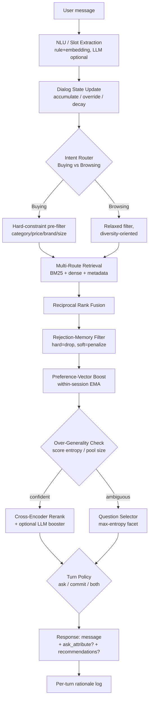

# 03 — System Architecture

Supersedes `/My Ideas/01_ARCHITECTURE.md` — same core shape (validated independently by both the
user's design pass and our 9-file research pass, which is a good sign), corrected/extended with
verified ground truth and research-recommended specifics. Living counterpart once building starts:
`wiki/01_architecture.md`.

## One turn, end to end



**Design rule confirmed by the scoring formula and the evaluator's own mechanics**: always attach the
current best top-10 when available, even on a turn that's also asking (combined ask+recommend is
CONFIRMED supported — see `02_TECHNICAL_PRD.md`). Never spend a turn asking without also returning the
current best guess.

## Component map

| Component | Owns | Phase | Notes |
|---|---|---|---|
| NLU / Slot Extraction | FR-1, FR-4 | 0 | Rule/gazetteer + embedding primary path; LLM only as an optional confidence-arbiter, never a hard dependency (NFR-2) |
| Dialog State (`DialogState`) | FR-4, FR-5, FR-7 | 0 | Slots, rejected_hard/soft (tiered), preference vector (EMA), turn count, candidate pool, pool entropy |
| Intent Router | FR-1 | 0 | Gazetteer + embedding hybrid; LLM arbiter only on disagreement/low confidence |
| Retrieval (BM25 + dense + metadata) | FR-2 | 0 | `bm25s`/FTS5 + small sentence-transformer + dict inverted index, fused via RRF |
| Rejection-Memory Filter | FR-4 | 0 | Hard = drop entirely; soft = score penalty, confidence-weighted |
| Preference-Vector Boost | FR-7 | 0/1 | EMA-updated positive/negative affinity vectors, additive ranking-time boost |
| Over-Generality Gate | FR-6 | 0 | Normalized Shannon entropy over post-retrieval scores; pool-size and score-gap as cross-checks |
| Question Selector | FR-6 | 0 | Max-entropy facet over the *live* candidate pool, phrased as closed catalog-grounded choice |
| Cross-Encoder Reranker | FR-3 | 0 | Guaranteed no-API stage; optional single-pass listwise LLM booster on ≤10-15 candidates if a key is configured |
| Turn Policy | FR-6, NFR-1 | 0 | Confidence-vs-turns-remaining; structurally forces a commit before turn 10 |
| Adaptive Orchestrator | FR-8 | 0/1 | Small explicit state machine (rerank-skip, blend-weight selection, clarification-aggressiveness), signal-gated not LLM-decided |
| Change-Point / Override Detector | FR-5 | 0/1 | Category-conflict rule (deterministic, primary) + negation keyword cues (secondary) |
| Debug/Rationale Logger | FR-10 | 0 | One line per turn: what matched, what was rejected, why this action |
| Multi-Interest Hypotheses | (ceiling) | 2, gated | K-vector routing; ships only if it wins the K-sweep ablation |
| Contextual Bandit Action Policy | (ceiling) | 2, gated | Adapts facet-choice value estimate within-session; ships only if it beats static policy |
| Offline Strategy Tuner | (ceiling) | 3, gated | SkillOpt-style rollout/score/edit/validate against dev sessions |
| Comparative Feedback Parser | (ceiling) | 3, gated | Text-routed only (no click/selection channel exists — CONFIRMED, see `06_DECISION_LOG.md` D9) |

## Data flow through `DialogState` (the "context distillation" object)

```
DialogState
├── slots: dict                    # open-vocabulary internally; projected onto the 11-value enum
│                                    # only when actually asking (see D10)
├── rejected_hard: dict            # {"color": ["green"]} — explicit reason given, strong confidence
├── rejected_soft: dict            # {"style": ["floral"]} — comparative/vague, medium confidence
├── rejected_soft_confidence: dict # per-key confidence weight, 0-1
├── pref_vector_pos / pref_vector_neg: np.ndarray  # EMA-updated affinity, ranking-time boost only
├── buying_intent_score: float     # 0-1, sets initial retrieval breadth + confidence threshold
├── turn_count / turns_remaining: int
├── candidate_pool: list[str]      # current ranked parent_asin list
├── pool_entropy: float            # drives the Over-Generality gate
├── override_history: list         # logged change-points, for debugging + the writeup
└── facet_utility_history: dict    # Phase 2 bandit input only, unused in Phase 0/1
```

This is the concrete meaning of "Personalized Context Distillation" (Pillar III) in this design: a
compressed, decision-relevant state that every downstream module reads from — never a growing raw
transcript re-fed each turn. See `06_DECISION_LOG.md` D4 and D-PROFILE for the full reasoning
(including why "long-term profile" is interpreted as a within-session, slower-decaying layer, not
cross-session storage).

## Why this shape, not a fancier one

- **Filter-then-rank, not rank-then-filter**, for hard constraints (Buying track) — guarantees
  constraint compliance and avoids returning fewer than K compliant results (`research/02`).
- **RRF, not a hand-tuned weighted sum**, for fusing heterogeneous signal types (BM25 score, cosine
  similarity, LLM permutation rank) — sidesteps score-scale calibration entirely (`research/02`, `03`;
  confirmed independently in `/My Ideas/` D1).
- **Cross-encoder as the guaranteed reranking stage, LLM as an optional booster** — the organizer
  provides no API key/credits; 2025-2026 benchmarks show a calibrated cross-encoder can match or beat
  general-purpose LLM rerankers on NDCG at a fraction of the latency (`research/03`). This is the
  single most consequential difference from the "LLM does the ranking" naive reading of Pillar I —
  Phase 0 must not have an LLM-shaped single point of failure.
- **Small explicit state machine for adaptive orchestration, not a free-form LLM controller** — a
  72-hour build needs to regression-test cleanly against Hit Rate@K/MRR/MTTC; an opaque "LLM decides
  everything" controller is unpredictable and hard to defend under judge questioning (`research/07`).
- **Deterministic rule for override detection (category-conflict), LLM/embedding only for open-ended
  slot extraction** — literature shows LLMs can verbally acknowledge a pivot while still leaking stale
  state ("stickiness"); the one place this system needs to be unambiguously reliable is guarded by a
  cheap, auditable rule, not a probabilistic judgment call (`research/04`).

## What is explicitly not in this architecture (Phase 0/1)

- No cross-session personalization layer of any kind (hypernetwork/LoRA or otherwise) — sessions are
  isolated single-user interactions with no cross-session identifier; this would never be exercised by
  the evaluator (D8, confirmed independently by both idea sources and our own research).
- No externally-hosted vector database — in-memory only, per the competition's own constraint. (FAISS
  run locally is fine — it's a library, not a hosted service — but unnecessary at 50K items regardless;
  plain NumPy is already sub-20ms.)
- No literal click/swipe/selection API surface — CONFIRMED the scored interface is strictly free-text
  turns in both directions (see `06_DECISION_LOG.md`, resolved Q3). Any comparative-feedback mechanism
  (Phase 3, gated) must arrive as ordinary message text.
- No multi-step neural world model, RL, or MCTS — any "planning ahead" mechanism (Phase 4, `11_FUTURE_WORK.md`)
  must stay within a 1-2 step hand-built heuristic lookahead, never a trained simulator.
